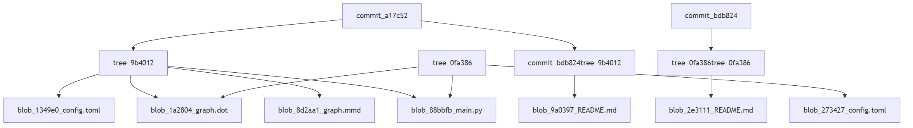
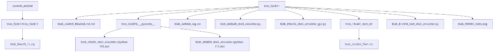
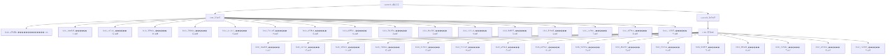

Задание №2
Разработать инструмент командной строки для визуализации графа
зависимостей, включая транзитивные зависимости. Сторонние средства для
получения зависимостей использовать нельзя.
Зависимости определяются для git-репозитория. Для описания графа
зависимостей используется представление Mermaid. Визуализатор должен
выводить результат на экран в виде графического изображения графа.
Построить граф зависимостей для коммитов, в узлах которого содержатся
сообщения. Граф необходимо строить только для тех коммитов, где фигурирует
файл с заданным хеш-значением.
10
Конфигурационный файл имеет формат toml и содержит:
• Путь к программе для визуализации графов.
• Путь к анализируемому репозиторию.
• Файл с заданным хеш-значением в репозитории.
Все функции визуализатора зависимостей должны быть покрыты тестами.

Визуализатор графа зависимостей коммитов Git
Этот проект представляет собой инструмент командной строки для визуализации графа зависимостей коммитов в Git-репозитории. Включает транзитивные зависимости и отображает их с помощью системы визуализации Mermaid.

Программа позволяет извлекать зависимости между коммитами в Git-репозитории.
Визуализировать граф зависимостей, где в узлах содержатся сообщения коммитов.
Выводить результат в виде изображения, используя программу для визуализации Mermaid.
Граф строится только для тех коммитов, в которых фигурирует файл с заданным хеш-значением.

Примеры работы:

Структура проекта
- main.py — основной скрипт для визуализации.
- config.toml — конфигурационный файл с параметрами.
- graph.mmd - код для визуализации графа.
- graph.png - вывод в формате .png
